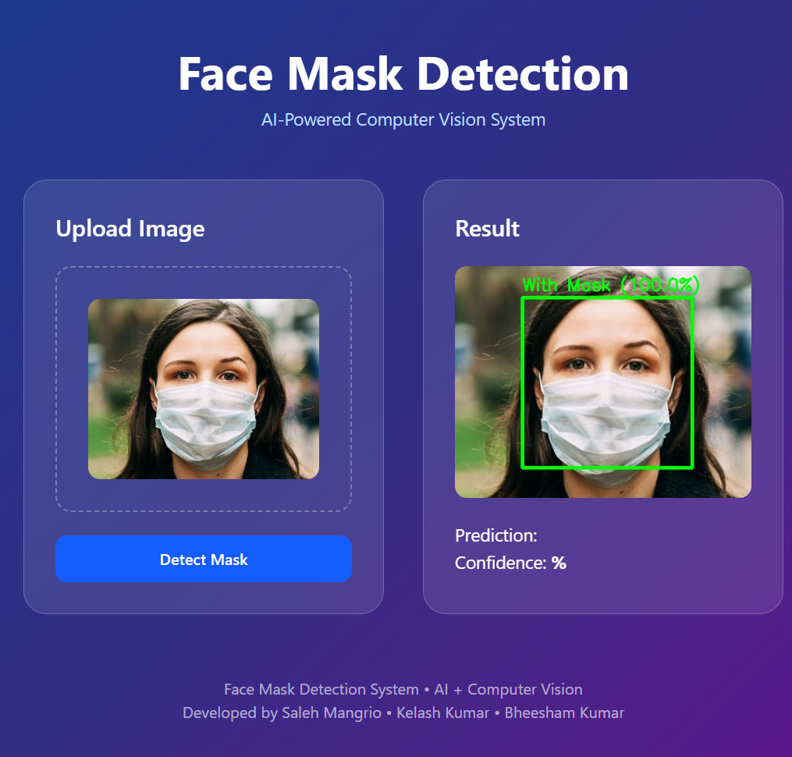

# Face Mask Detection System

A full-stack web application that detects face masks in images using a custom deep learning model. Built with FastAPI backend and React frontend, this system provides both visual detection with bounding boxes and JSON-based predictions.


---

## 📋 Table of Contents

- [Frontend UI/UX](#mainpage)
- [Features](#features)
- [Tech Stack](#tech-stack)
- [Project Structure](#project-structure)
- [Prerequisites](#prerequisites)
- [Installation](#installation)
- [Running the Application](#running-the-application)
- [API Documentation](#api-documentation)
- [Usage](#usage)
- [Contributing](#contributing)
- [License](#license)

---
## MainPage



## ✨ Features

- **Real-time Face Mask Detection**: Detect masks in images using a trained CNN model
- **Image Processing**: Automatic face detection with bounding boxes
- **Dual Response Formats**: 
  - Visual response with annotated images
  - JSON response with confidence scores
- **Responsive UI**: Modern, user-friendly interface built with React and Tailwind CSS
- **RESTful API**: Clean and documented FastAPI endpoints
- **Error Handling**: Comprehensive error handling and validation
- **CORS Support**: Ready for cross-origin requests

---

## 🛠️ Tech Stack

### Backend
- **FastAPI** - Modern Python web framework
- **TensorFlow/Keras** - Deep learning model inference
- **OpenCV** - Image processing and computer vision
- **Python 3.9+** - Programming language

### Frontend
- **React 19.2.5** - UI library
- **Vite** - Fast build tool and dev server
- **Tailwind CSS** - Utility-first CSS framework
- **Axios** - HTTP client library
- **ESLint** - Code linting

---

## 📁 Project Structure

```
face-mask-detect/
├── backend/
│   ├── app/
│   │   ├── __init__.py
│   │   ├── main.py              # FastAPI application & routes
│   │   ├── model.py             # Model inference logic
│   │   └── utils.py             # Utility functions
│   ├── models/
│   │   └── face_mask_detect.keras  # Pre-trained model
│   ├── requirements.txt          # Python dependencies
│   ├── Dockerfile               # Docker configuration
│   └── face-mask-detection-project.ipynb  # Jupyter notebook
│
├── frontend/
│   ├── src/
│   │   ├── App.jsx             # Main App component
│   │   ├── main.jsx            # Entry point
│   │   ├── index.css           # Global styles
│   │   └── assets/             # Static assets
│   ├── public/                 # Public files
│   ├── package.json            # NPM dependencies
│   ├── vite.config.js          # Vite configuration
│   ├── eslint.config.js        # ESLint configuration
│   └── index.html              # HTML template
│
├── .gitignore                  # Git ignore rules
└── README.md                   # This file
```

---

## 📦 Prerequisites

### Backend Requirements
- Python 3.9 or higher
- pip package manager
- CUDA (optional, for GPU acceleration)

### Frontend Requirements
- Node.js 14.0 or higher
- npm or yarn package manager

---

## 🚀 Installation

### Backend Setup

1. **Navigate to backend directory**
   ```bash
   cd backend
   ```

2. **Create a virtual environment**
   ```bash
   # Windows
   python -m venv venv
   venv\Scripts\activate
   
   # Linux/Mac
   python3 -m venv venv
   source venv/bin/activate
   ```

3. **Install Python dependencies**
   ```bash
   pip install -r requirements.txt
   ```

4. **Environment Configuration**
   ```bash
   # Create .env file (optional)
   echo "" > .env
   ```

### Frontend Setup

1. **Navigate to frontend directory**
   ```bash
   cd frontend
   ```

2. **Install Node dependencies**
   ```bash
   npm install
   ```

3. **Environment Configuration**
   Create a `.env.local` file:
   ```env
   VITE_API_URL=http://localhost:8000
   ```

---

## ▶️ Running the Application

### Start Backend Server

```bash
cd backend
python -m uvicorn app.main:app --reload --host 0.0.0.0 --port 8000
```

The API will be available at: `http://localhost:8000`

### Start Frontend Development Server

In a new terminal:
```bash
cd frontend
npm run dev
```

The application will be available at: `http://localhost:5173`

### Production Builds

**Frontend Build**
```bash
cd frontend
npm run build
```

**Backend Production**
```bash
cd backend
python -m uvicorn app.main:app --host 0.0.0.0 --port 8000
```

---

## 📚 API Documentation

### Interactive API Docs
- **Swagger UI**: http://localhost:8000/docs
- **ReDoc**: http://localhost:8000/redoc

### Endpoints

#### 1. **GET /home**
Returns API status and available endpoints.

**Response:**
```json
{
  "message": "Face Mask Detection API is running",
  "endpoints": {
    "/predict": "Returns image with bounding box",
    "/predict/json": "Returns JSON response"
  }
}
```

#### 2. **POST /predict**
Uploads an image and returns the annotated image with bounding boxes.

**Parameters:**
- `file` (multipart/form-data): Image file (JPEG, PNG, etc.)

**Response:**
- Image with bounding boxes and labels
- Headers:
  - `X-Prediction`: Prediction label (e.g., "with_mask", "without_mask")
  - `X-Confidence`: Confidence score (0-1)

**Example (curl):**
```bash
curl -X POST "http://localhost:8000/predict" \
  -H "accept: image/jpeg" \
  -F "file=@image.jpg" \
  -o result.jpg
```

#### 3. **POST /predict/json**
Uploads an image and returns prediction data as JSON.

**Parameters:**
- `file` (multipart/form-data): Image file

**Response:**
```json
{
  "prediction": "with_mask",
  "confidence": 0.95,
  "timestamp": "2026-04-30T10:30:45.123Z"
}
```

**Example (curl):**
```bash
curl -X POST "http://localhost:8000/predict/json" \
  -F "file=@image.jpg" \
  | jq
```

---

## 💻 Usage

### Via Web Interface

1. Open http://localhost:5173 in your browser
2. Click on the upload area or select an image
3. View the prediction results
4. Download or analyze the results

### Via API (curl examples)

**Upload and get annotated image:**
```bash
curl -X POST "http://localhost:8000/predict" \
  -F "file=@path/to/image.jpg" \
  -o result.jpg
```

**Upload and get JSON prediction:**
```bash
curl -X POST "http://localhost:8000/predict/json" \
  -F "file=@path/to/image.jpg"
```

### Via Python

```python
import requests

# Upload image and get JSON prediction
url = "http://localhost:8000/predict/json"
files = {"file": open("image.jpg", "rb")}
response = requests.post(url, files=files)
print(response.json())

# Output: {"prediction": "with_mask", "confidence": 0.95, "timestamp": "..."}
```

---

## 📊 Model Information

- **Architecture**: Custom Convolutional Neural Network (CNN)
- **Framework**: TensorFlow/Keras
- **Classes**: 
  - `with_mask`: Person wearing a face mask
  - `without_mask`: Person not wearing a face mask
- **Input Size**: 224x224 pixels
- **Model File**: `backend/models/face_mask_detect.keras`

---

## 🐳 Docker Support

### Build Docker Image
```bash
docker build -t face-mask-detect:latest -f backend/Dockerfile .
```

### Run Docker Container
```bash
docker run -p 8000:8000 face-mask-detect:latest
```

---

## 🔧 Development

### Backend Development
- FastAPI automatically reloads on code changes
- Access Swagger UI for API testing at `/docs`
- Logs are printed to console

### Frontend Development
- Vite provides HMR (Hot Module Replacement)
- ESLint runs for code quality
- Access dev tools in browser DevTools

### Run Linting
```bash
cd frontend
npm run lint
```

---

## ⚠️ Troubleshooting

### Model not found error
```
FileNotFoundError: backend/models/face_mask_detect.keras
```
**Solution**: Ensure the Keras model file exists in `backend/models/`

### CORS errors
**Solution**: Check that both frontend and backend are running on correct ports and `.env` is configured properly

### Port already in use
```bash
# Kill process on port 8000 (backend)
lsof -ti:8000 | xargs kill -9

# Kill process on port 5173 (frontend)
lsof -ti:5173 | xargs kill -9
```

### GPU not detected
- Ensure CUDA and cuDNN are properly installed
- Check TensorFlow GPU support: `python -c "import tensorflow as tf; print(tf.config.list_physical_devices('GPU'))"`

---

## 📝 Contributing

Contributions are welcome! Please follow these steps:

1. Fork the repository
2. Create a feature branch (`git checkout -b feature/AmazingFeature`)
3. Commit your changes (`git commit -m 'Add AmazingFeature'`)
4. Push to the branch (`git push origin feature/AmazingFeature`)
5. Open a Pull Request

---

## 📄 License

This project is licensed under the MIT License - see the LICENSE file for details.

---

## 👨‍💻 Author

Developed by **Saleh Mangrio**

---

## 🙏 Acknowledgments

- TensorFlow/Keras for the deep learning framework
- FastAPI for the modern Python web framework
- React for the UI library
- OpenCV for image processing

---

## 📧 Support

For issues, questions, or suggestions, please open an issue on GitHub.

**GitHub Repository**: https://github.com/Salehmangrio/face-mask-detect

---

**Last Updated**: April 30, 2026
